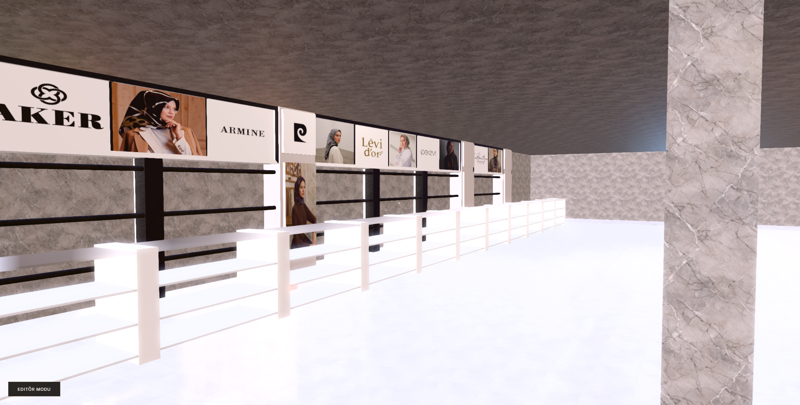
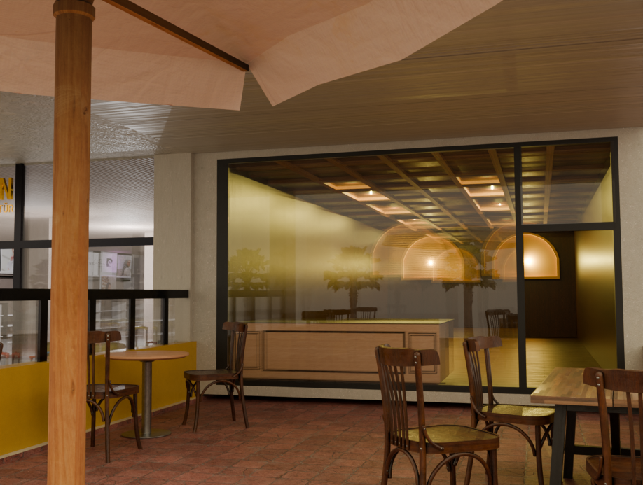
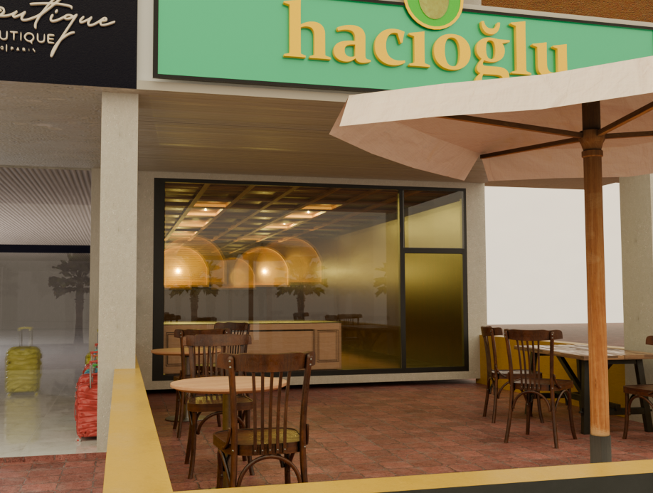
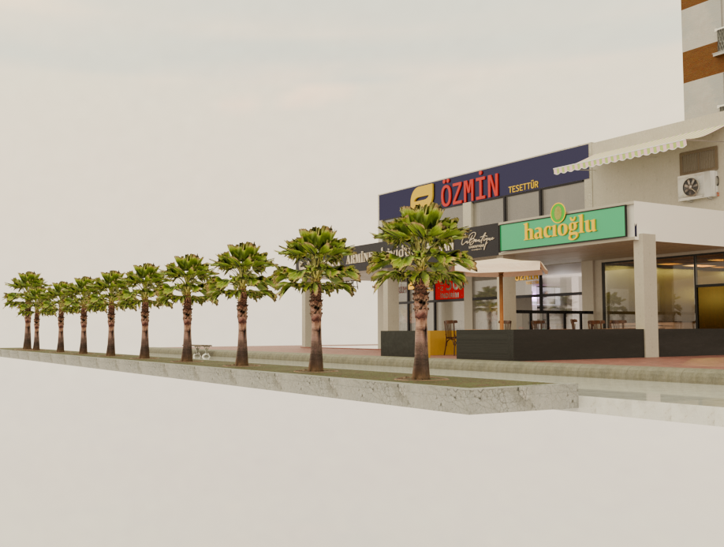
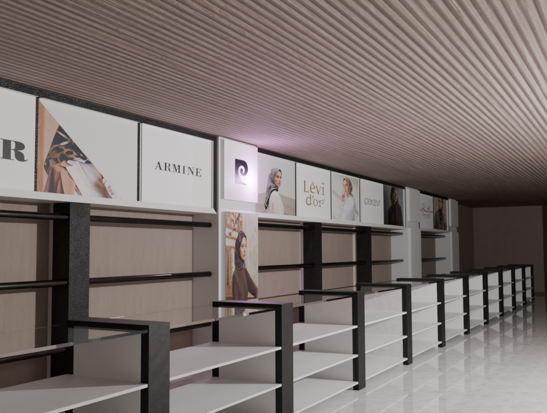

# Uzunçarşı 3D Simülasyonu

Babylon.js tabanlı, tarayıcı üzerinden çalışan 3D ürün yerleştirme ve görselleştirme projesidir.

## Teknik Altyapı ve Özellikler

- **Render Motoru:** Babylon.js (WebGL/WebGPU destekli).
- **Post-Processing & Aydınlatma:** ACES Tone Mapping, aktif IBL (Sıcak mağaza tonları: Color3(0.85, 0.75, 0.65)). SSAO2 (8 sample) ile mikro-gölgelendirme, SSR (Screen Space Reflections) ile zemin yansımaları, Volumetric Light Scattering (God Rays, 50 sample). PCF (Percentage Closer Filtering) destekli Point Light gölgelendirmesi (1024px).
- **Veri Yönetimi:** IndexedDB (v3) kullanılarak tarayıcı tarafında asenkron nesne kaydı (Entity ID, Position, Rotation, Color).
- **Performans Optimizasyonu:** Yaklaşık 240MB'lık statik alan modeli (`binaaktıf2.glb`) için `freezeWorldMatrix` ve `doNotSyncBoundingInfo` metodları uygulanarak 60 FPS hedeflenmiştir.
- **Editör Modu:** Çalışma zamanında (Runtime) sahneye obje ekleme (Instancing), `GizmoManager` üzerinden XYZ pozisyon/rotasyon manipülasyonu.

## Ekran Görüntüleri


## Modelleme İlerlemeleri
Projenin 3D modelleme aşamasındaki güncel ilerlemeleri ve dükkan dış cephe tasarımları aşağıda sunulmuştur:






## Nasıl Çalıştırılır?

Projeyi kendi bilgisayarınızda çalıştırmak için aşağıdaki adımları izleyin:

### Gereksinimler
- Bilgisayarınızda **Node.js** yüklü olmalıdır.

### Kurulum Adımları
1. Bu depoyu (repository) bilgisayarınıza indirin (ZIP olarak indirin veya `git clone` komutunu kullanın).
2. İndirdiğiniz klasörün içine girin ve komut satırını (Terminal/CMD) açın.
3. Gerekli kütüphaneleri yüklemek için aşağıdaki komutu çalıştırın:
   ```bash
   npm install
   ```
4. Yükleme tamamlandıktan sonra, projeyi başlatmak için şu komutu çalıştırın:
   ```bash
   npm run dev
   ```
5. Komut çalıştıktan sonra ekranda beliren adresi (genellikle `http://localhost:5173/`) tarayıcınıza kopyalayıp enter'a basın.

## Kontroller
- **W, A, S, D:** Kamerayı hareket ettirir (İleri, Sola, Geri, Sağa).
- **Fare (Sol Tık Basılı Tutarak):** Etrafa bakmanızı sağlar.
- **Fare (Sol Tık):** Ürünlere tıklayarak bilgi ekranını açar veya Editör modundayken objeleri seçmenizi sağlar.
